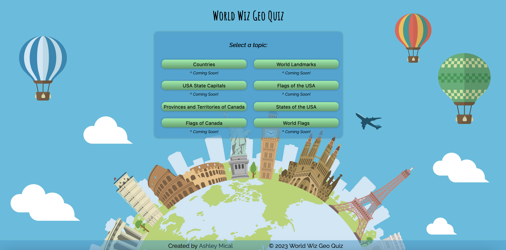
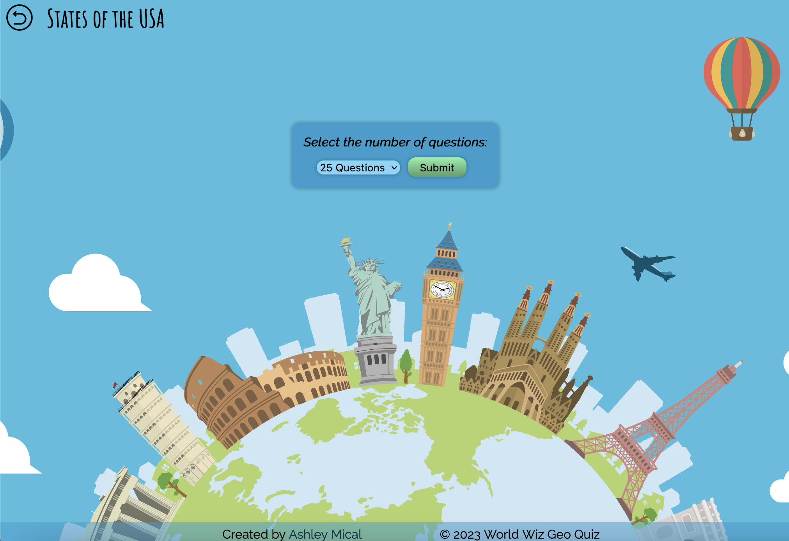
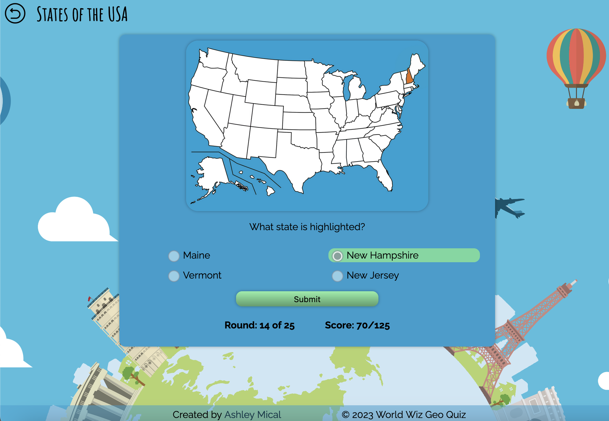
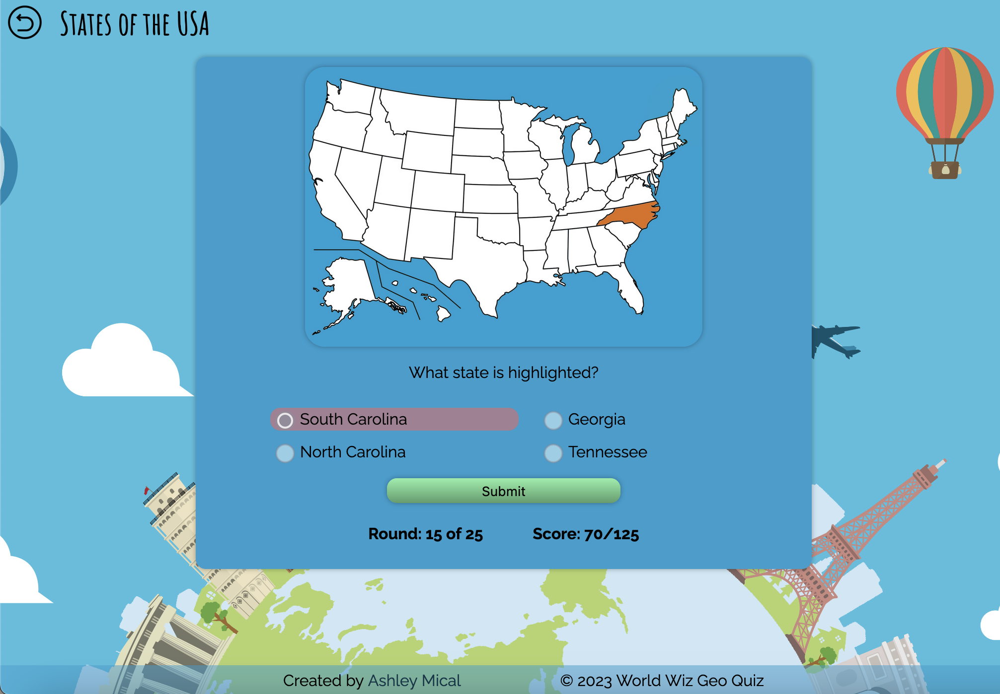
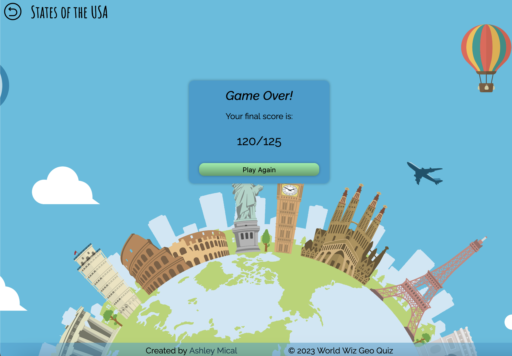

# Geo Quiz

Work in progress. A quiz game for learning flags, countries, states, and capitals.

## Table of contents

- [Overview](#overview)
  - [Screenshot](#screenshot)
  - [Links](#links)
- [My process](#my-process)
  - [Built with](#built-with)
  - [What I learned](#what-i-learned)
  - [Continued development](#continued-development)
- [Author](#author)

## Overview

### Screenshot

### Links

- Solution URL: [GitHub Project Page](https://github.com/micamash/geo-quiz)
- Live Site URL: [Geo Quiz]()

## My process

### Built with

-HTML
-CSS
-JavaScript
-Java
-Vue.js
-SQL

-IntelliJ
-Visual Studio Code
-PostgreSQL

### What I learned

-Continued practice building an API and also using Vue.js.

### Continued development

-Add timer to quizzes.
-Highlight correct answer when user answers incorrectly.
-Create databases for other quiz topics.

## Author

- Website - [My GitHub](https://github.com/micamash)
